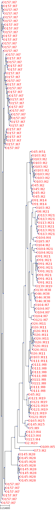

# Figures

<!-- 
![The effect of kmer sizes 3 - 31 and kmer frequency cutoff values of 1 - 15 in the correct prediction of host-source among _E. coli_ O157:H7 using WGS from the Lupolova et al. (2016) dataset [@Lupolova2016].](./images/KmerLength.pdf){#fig:kmer}

![The effect of various feature selection methods and the amount of features removed in the correct prediction of host-source amoung _E. coli_ O157:H7 using WGS from the Lupolova et al. (2016) dataset [@Lupolova2016].](./images/FeatureSelection.pdf){#fig:featureselection}

{#fig:serotype}

{#fig:otype}

{#fig:htype}

{#fig:multiclass}

{#fig:hosts} -->

\newpage